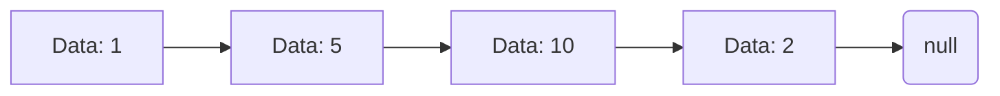

# Linked List 🔗

- Linear Data Structure where elements (nodes) are stored in sequence.
- Each node points to the next node.
- Non Contiguos memory allocation.
- Nodes store data and memory address of next node.
- Used in dynamic memory allocation, graph representation.

<br>



<br>

# Terminologies

## Node:
- Node is the single element of list
- When multiple nodes are connected in sequence they form linked list.
- Node generally consist of two components `data` and `next`

## Data:
- it holds data or value associated to the node.

## Next:
- This holds the 

- Node
- next :
- head :
- tail :

# Methods

Following Methods are generally available in linked list.

## \_\_is_empty

Methods is used to check if the linked list is empty.

- Linked list is said to be empty when head of list

Logic

```python
if head is None:
  return True
else:
  return False
```
