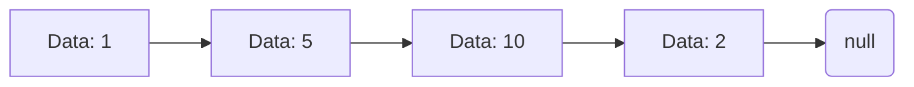

# Linked List 🔗

-   Linear Data Structure where elements (nodes) are stored in sequence.
-   Each node points to the next node.
-   Non Contiguos memory allocation.
-   Nodes store data and memory address of next node.
-   Used in dynamic memory allocation, graph representation.

<br>



<br>

# Terminologies

## Node:

-   Node is the single element of list
-   When multiple nodes are connected in sequence they form linked list.
-   Node generally consist of two components `data` and `next`

## Data:

-   it holds data or value associated to the node.

## Next:

-   This holds the memory reference of next node in linked list

## Head:

-   Head is the first or the starting node of the linked list.

## tail:

-   Tail is the last node which points to nullptr or null or None which shows that linked list ends here.

# Methods

Following Methods are generally associated with linked list.

## `__is_empty`

Methods is used to check if the linked list is empty.

-   Linked list is said to be empty when head of list

### Example

```python
def __is_empty():
  if head is None:
    return True
  else:
    return False
```

## `insert_at_beginning`

This method is used to insert a node at the very first position of the linked list.

### Steps

1. Create a new node `new_node` with `data`.
2. If `head` is null:  
   2.1. Set `head` to `new_node`  
   2.2.Set `new_node.next` to null

3. If `head` is not null:  
   3.1. Set `new_node.next` to `head`  
   3.2. Set `head` to `new_node`

### Example

```python
def insert_at_beginning(data):
    if head is None:
        head = Node(data)
    else:
        new_node = Node(data)
        new_node.next = head
        head = new_node
```

## `insert_at_end`

This method is used to insert a node at the end of the linked list.

### Steps

1. Check if `head` is None
2. If `head` is None  
   2.1. Set `head` to `new_node`
3. If `head` is not None  
   3.1. Iterate over the linked list till the last node  
   3.2. Set the `next` of the last node to `new_node`  
   3.3. Set the `next` of `new_node` to null

### Example

```python
def insert_at_end(data):
    if head is None:
        head = Node(data)
    else:
        current = head
        new_node = Node(data)
        while current.next is not None:
            current = current.next
        current.next = new_node
        new_node.next = None
```

## `insert_at_position`

This method is used to insert a node at a specific position in the linked list.

### Steps

1. Check if index is 0
2. If true  
   2.1. Call method `insert_at_beginning`
3. else  
   3.1. iterate over linked list till index - 1  
   3.2. set `new_node`'s `next` to `current.next`  
   3.3. set `current.next` to `new_node`

### Example

```python
def insert_at_position(data, index):
    if index == 0:
        insert_at_beginning(data)
    else:
        current = head
        new_node = Node(data)
        while current is not None and position + 1 != index:
            current = current.next
            position += 1

        new_node.next = current.next
        current.next = new_node
```

## `update_data_at_position`

This method is used to update the data at a specific position in the linked list.

### Steps

1. Check if linked list is empty  
   1.1. if empty return
2. iterate over linked list till position  
   2.1. check if node is present or not  
   2.2. if not present return  
   2.3. set `current.data` to `data`

### Example

```python
def update_node_at_position(data, index):
  if __is_empty():
    return

  current = head
  while current is not None and position != index:
    current = current.next
    position += 1

    if current is None:
      return

    current.data = data
```

## `delete_first_node`

This method is used to remove the first node of linked list

### Steps

1. Check if linked list is empty  
   1.1. if empty return
2. set `head` to `head.next`

### Example

```python
def remove_first_node():
  if __is_empty():
    return

  head = head.next
```


## `delete_last_node`
This method is used to remove the last node of linked list

### Steps
1.1.